# Mapnik Tile Renderer

Mapnik Tile Render to render 256x256pixel map tiles in server-clients mode with network support

Supports local and network modes:

In network mode, the server distributes cutting tasks between connected clients,
which, in turn, cut the required squares and put the tiles in the storage.
In the event of a slicing error at the client, the server re-sends several times
the same task to eliminate network errors. Server and clients are started separately, as
on one or several different computers. This architecture one server - many
clients can significantly reduce the time for cutting large maps, because can be dynamically
connect and disconnect clients as free computers appear. For example, you can
use this scheme at night when most office computers are idle.

In local mode, all slicing is done stand alone. 

Это приложение для нарезки тайлов растровых карт 256х256 пикселей.

Поддерживает локальный и сетевой режимы:

В сетевом режиме сервер распределяет задания по нарезке между подключенными клиентами,
которые в свою очередь выполняют нарезку нужных квадратов и кладут тайлы в хранилище.
В случае возникновения ошибки нарезки у клиента, сервер несколько раз повторно отдает
то же задание, для исключения сетевых ошибок. Сервер и клиенты запусакаюся отдельно, как
на одном, так и на нескольких разных компьютерах. Данная архитектура один сервер - много
клиентов позволяет значительно сократатить время нарезки больших карт, т.к. можно динамически
подкллючать и отключать клиентов по мере появления свободных компьютеров. Например, можно
использовать в ночное время, когда большинство рабочих компьютеров офиса простаивают.

В локальном режиме вся нарезка выполняется одним приложнием.

Main Window:    
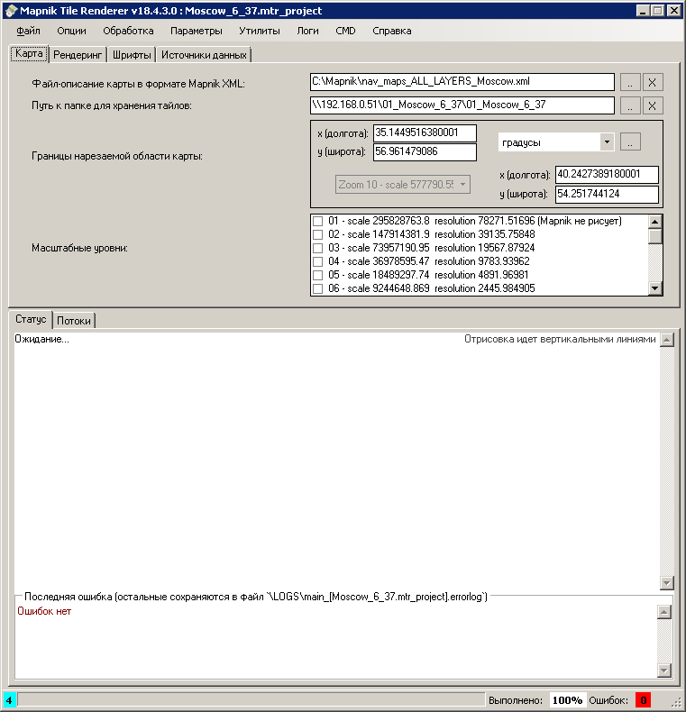
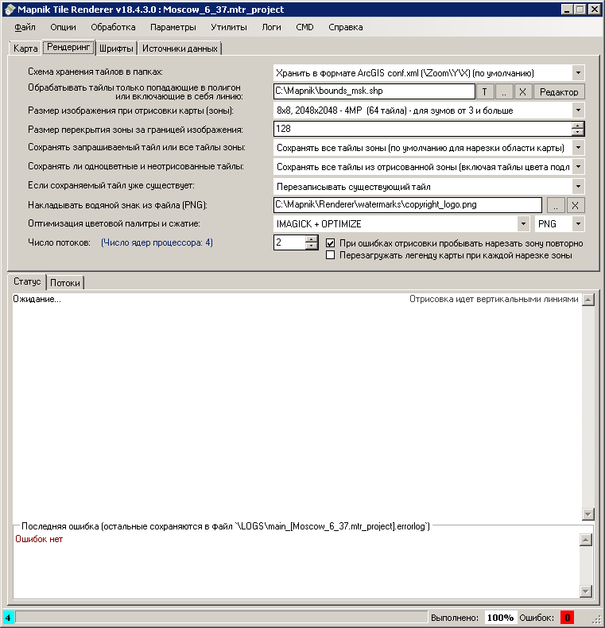      
Map Preview Window:    
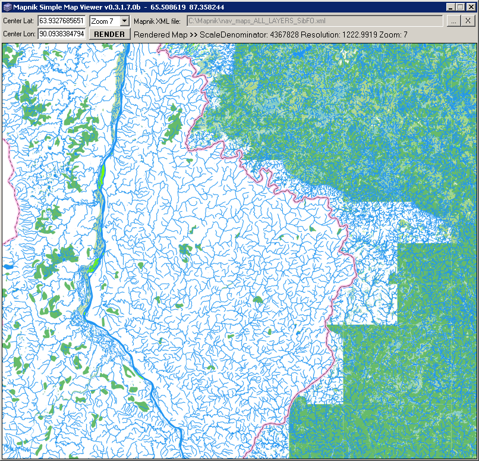     
Tiles View Window:    
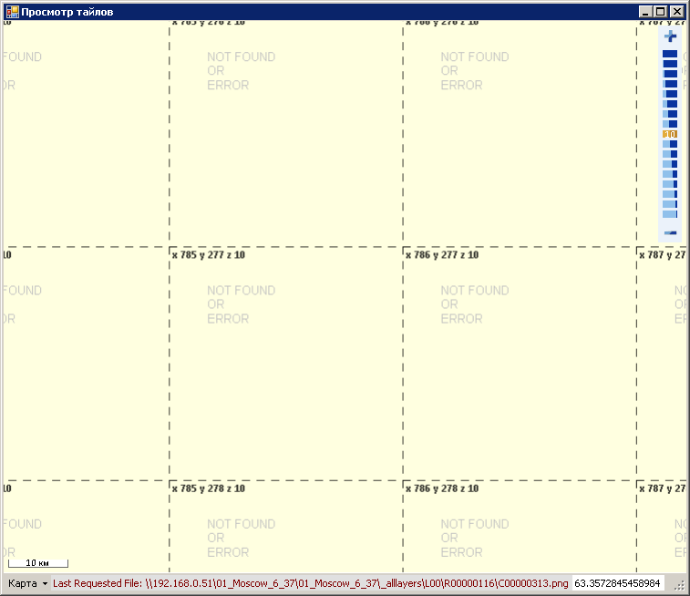     
Stand Alone Process:    
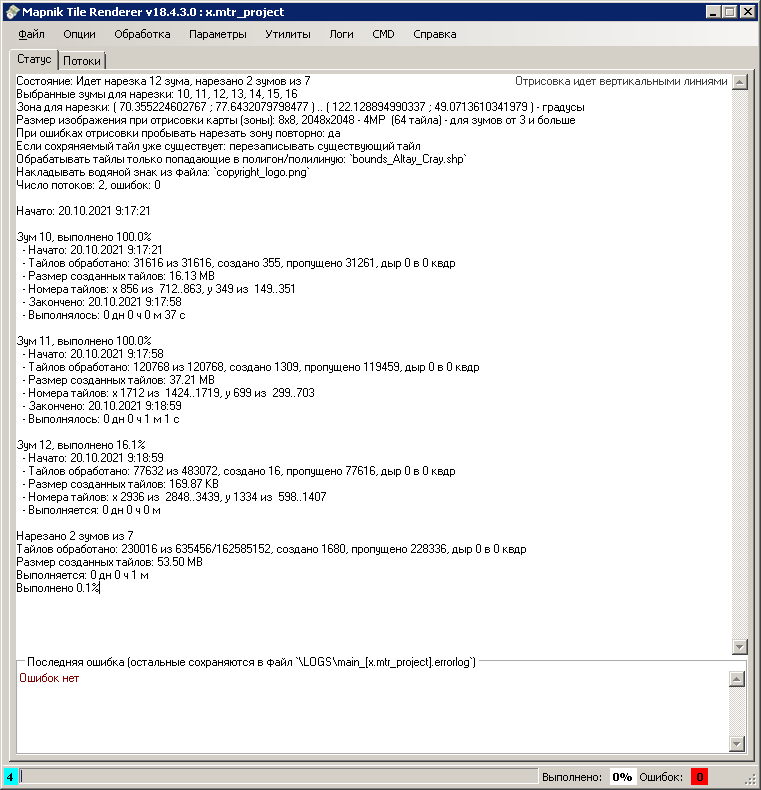
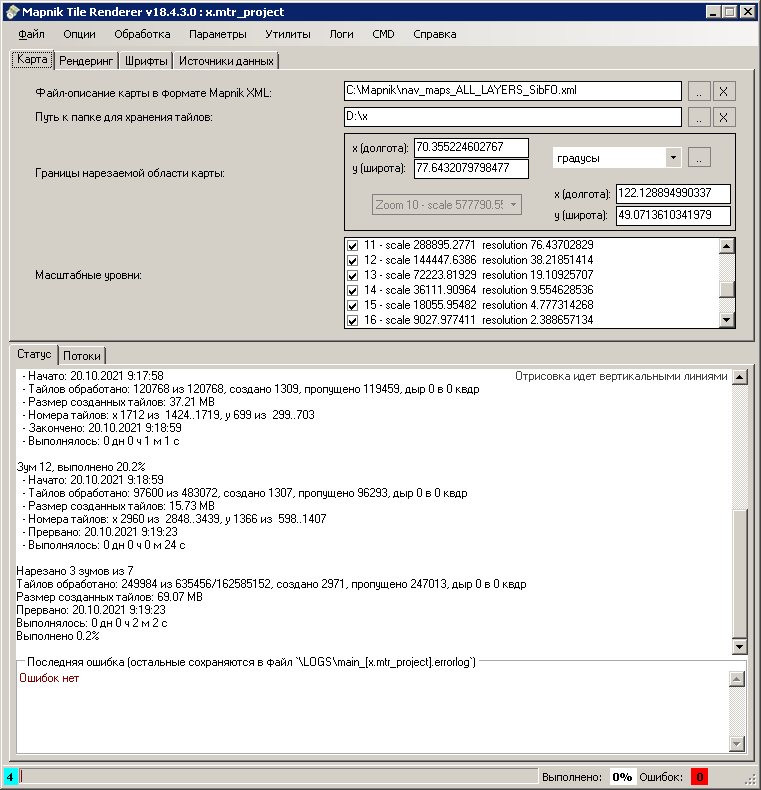    
Console Process:    
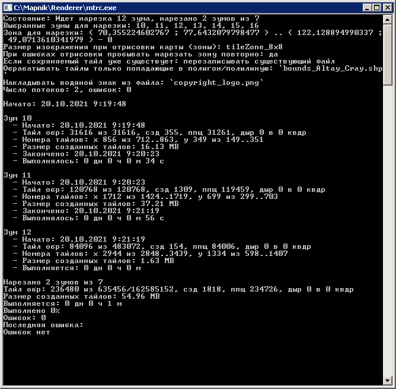    
Server Process:    
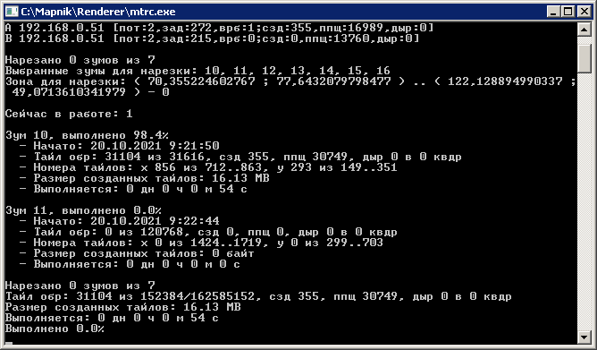     
Client Process:    
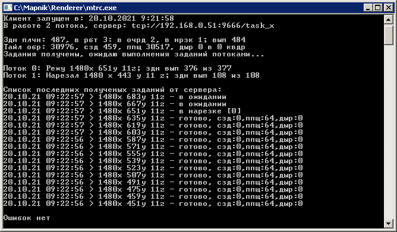    
Process Info:    
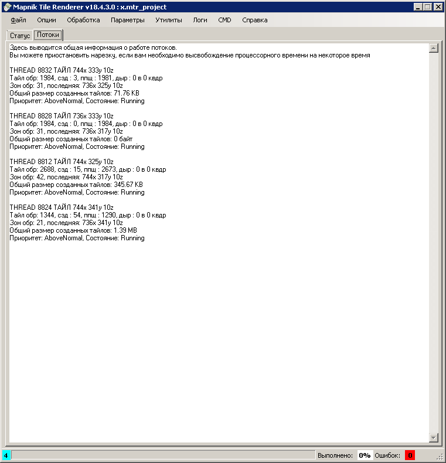   
Coverage Status:     
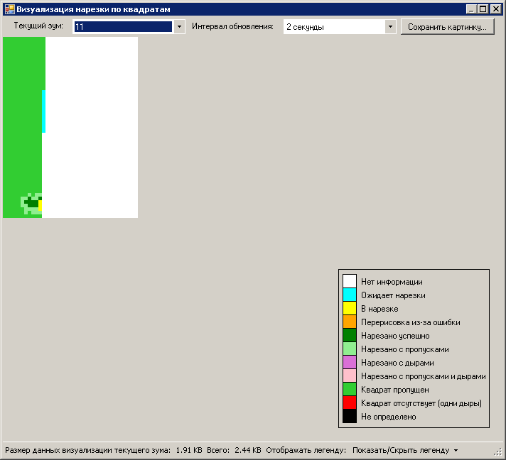   
Web Status:     
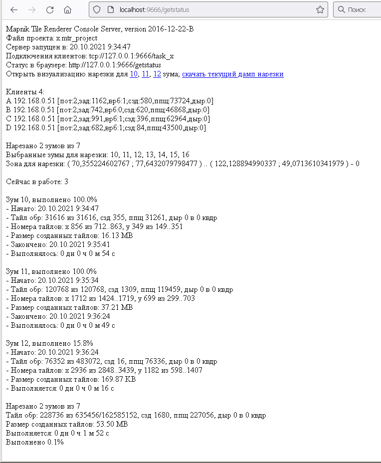   
Web Coverage Status    
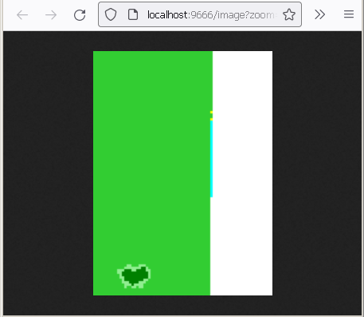   
Overall Server Status:   
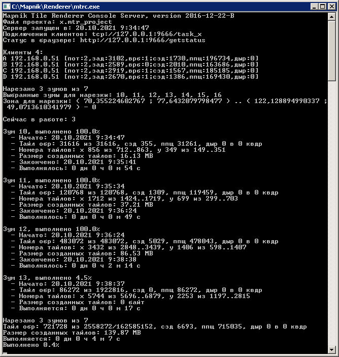   
